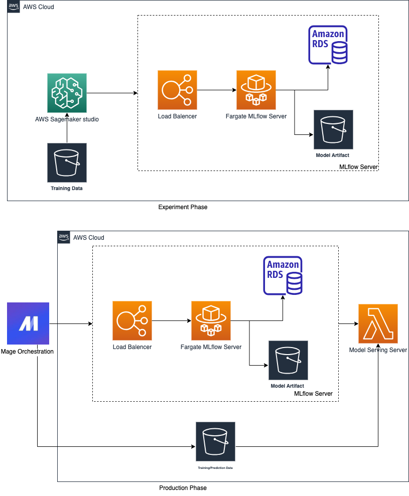
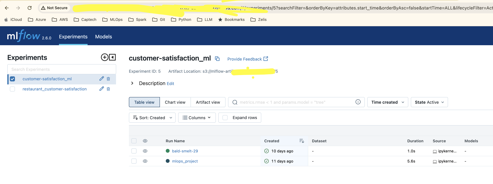
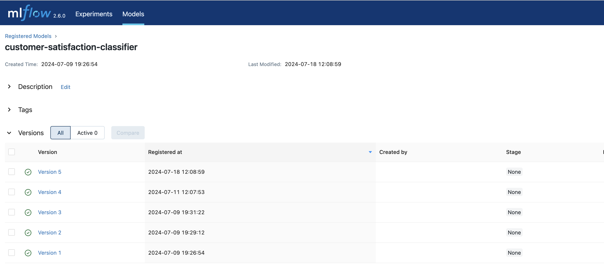
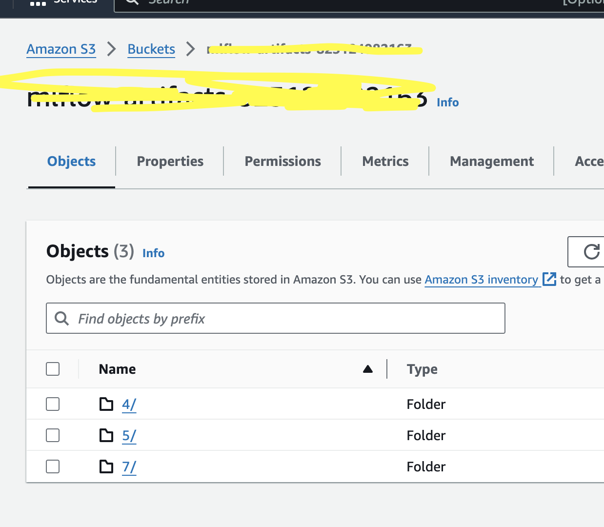
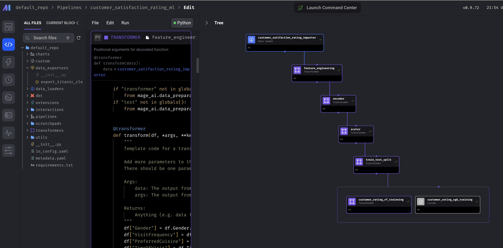

# 2024 MLops Zoomcamp Customer Satisfaction at Restaurants Prediction Project

## Description
Welcome to the 2024 MLOps Zoomcamp Customer Satisfaction Prediction Project.

In this project, we aim to predict customer satisfaction at restaurants using a machine learning pipeline and create a MLops pipeline with Microsoft MLops Maturity level 2 with automated training using Mage ai. We utilize a dataset from Kaggle, the [Predict Restaurant Customer Satisfaction Dataset](https://www.kaggle.com/datasets/rabieelkharoua/predict-restaurant-customer-satisfaction-dataset/data), to build and deploy our models. The project covers the end-to-end MLOps lifecycle, including data preprocessing, model training, hyperparameter tuning, and model deployment.

The services are deployed on AWS using CloudFormation (with AWS CDK), and the project demonstrates the integration of various AWS services such as SageMaker, S3, Lambda, and more.

Key components of this project include:

- Deploying an MLflow Server: Using AWS CDK to deploy and manage an MLflow server for experiment tracking and model registry.
- Model Training: Training a Random Forest Classifier and XGBoost Classifier in Amazon SageMaker Studio, with the models and artifacts stored in an S3 bucket.
- Hyperparameter Tuning: Performing hyperparameter tuning on the XGBoost model and registering the best model parameters in MLflow.
- MLops Orchestraction: Using Mage AI automate the training pipeline and model deployment
- Model Deployment: Deploying the trained model as an AWS Lambda function using AWS CDK for serverless inference.

References: [Manage your machine learning lifecycle with MLflow and Amazon SageMaker](https://github.com/aws-samples/amazon-sagemaker-mlflow-fargate)
[Mage AI docker](https://github.com/mage-ai/docker)
[Microsoft MLops Maturity Level](https://learn.microsoft.com/en-us/azure/architecture/ai-ml/guide/mlops-maturity-model)

## Table of Contents

- [Overview](#overview)
- [prerequisites](#prerequisites)
- [Installation](#installation)
- [Usage](#usage)

## Overview
This project I break it down into different compounent, the services are all deployed to AWS and using CloudFormation(CDK) to deploy.

1. Deploy a MLflow server through CDK
2. Train a Random Forest Classifier and XGBoost Classifier in SageMaker studio and store model artifast in S3 bucket
3. Hyperparameter tuning XGBoost model and register the best parameter in MLflow
4. Productionize the training pipeline in Mage to orchestrate the flow
5. Deploy model through CDK as a Lambda function
6. CI enabled through GitHub Action



## Prerequisites
1. AWS Account
You need an AWS account with sufficient permissions to create and manage resources such as S3 buckets, Lambda functions, and SageMaker instances.

2. AWS CLI
Install and configure the AWS Command Line Interface (CLI) to interact with AWS services.
[Install AWS CLI](https://docs.aws.amazon.com/cli/latest/userguide/getting-started-install.html)
Configure AWS CLI with your credentials
```
aws configure
```

3. Python and Pipenv
Ensure you have at least 3.10 python installed and latest pipenv

4. Docker
Install Docker to build and deploy containerized applications.

## Installation
1. Clone the Repository
```
git clone https://github.com/ruqianq/aws-xgboost-mlops-project
```

2. Install Required Packages and activate the virtual environment
Install required package through pipenv
```
pipenv install
pipenv shell
```

3. Set Up Environment
```
export AWS_ACCESS_KEY_ID = [YOUR AWS ACCESS KEY ID]
export AWS_SECRET_ACCESS_KEY = [YOUR AWS SECRET ACCESS KEY]
export AWS_REGION=[YOUR AWS REGION]
```

## Usage
1. Deploying MLflow Server as experiment tracking in AWS
    i. Navigate to the MLflow Directory
    ```
    cd experiment-tracking
    ```
    ii. Deploy MLflow using AWS CDK
    ```
    ACCOUNT_ID=$(aws sts get-caller-identity --query Account | tr -d '"')
    AWS_REGION=$(aws configure get region)
    cdk bootstrap aws://${ACCOUNT_ID}/${AWS_REGION}
    cdk deploy --parameters ProjectName=mlflow --require-approval never
    ```
    iii. Then you can navigate to your CloudFormation output and get the URL of your remote MLflow server
    ```
    import mlflow
    mlflow.set_tracking_uri('<YOUR LOAD BALANCER URI>')
    ```
    NOTE: this example is from [this repo](https://github.com/aws-samples/amazon-sagemaker-mlflow-fargate) from AWS
    

2. Training and register model in SageMaker
    i. Open SageMaker Studio in AWS and Create a domain
    ii. Navigate to notebooks
    ```
    cd notebooks
    ```
    iii. Upload notebooks and run all the blocks and in the end you should be able to register the model and see the model artifest save under S3 bucket:
    
    

3. Training and register model in Mage
    i. Navigate to orchestration
    ```
    cd orchestration
    ```
    ii. Run the docker compose
    ```
    docker-compose up
    ```
    iii. Navigate to [localhost](http://localhost:6789/)
    iiii. Run the pipeline:
    

 ## Future Enhancement 
 - [ ] Model Monitoring
 - [ ] CD release pipeline